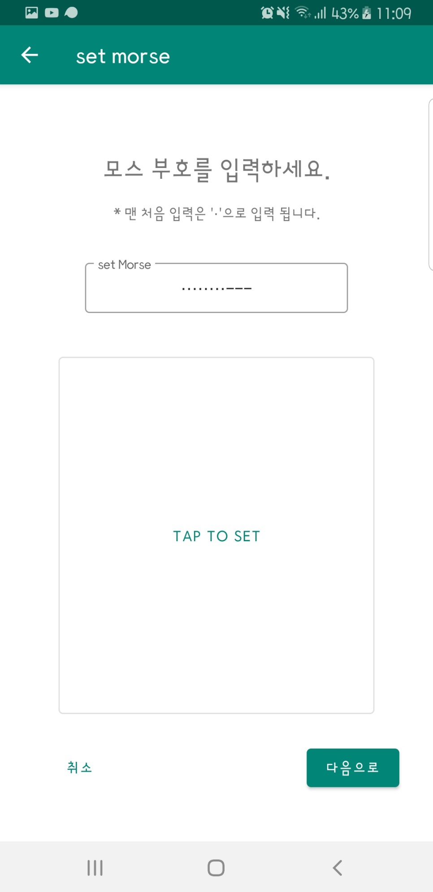
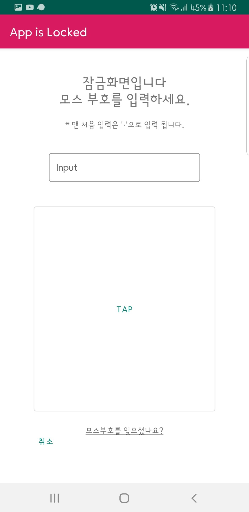
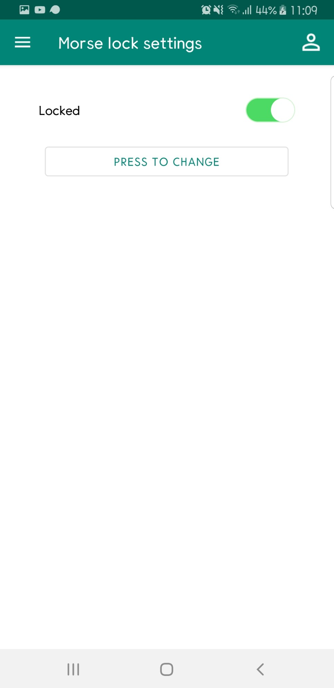

# MorseLock

- 블로그: https://blog.naver.com/jhs030526/221729401607
- 개발 언어: `Java`
- 개발 기간: `2019.12` (약 1주)

앱 기초 소수전공의 개인 프로젝트로 모스부호 개념을 차용한 잠금화면 앱을 개발하였습니다.

|                 1                 |                2                |                    3                    |
| :-------------------------------: | :-----------------------------: | :-------------------------------------: |
|  |  |  |
